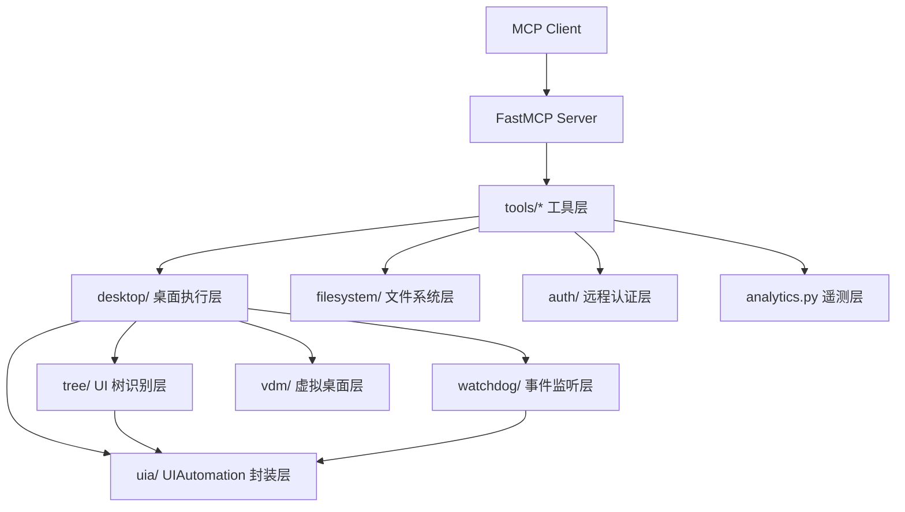
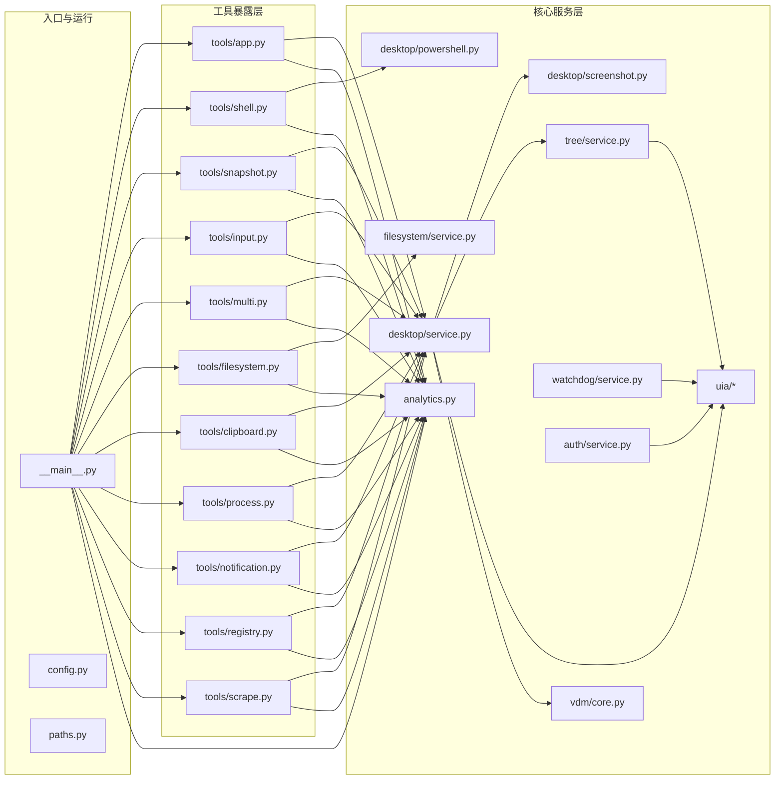
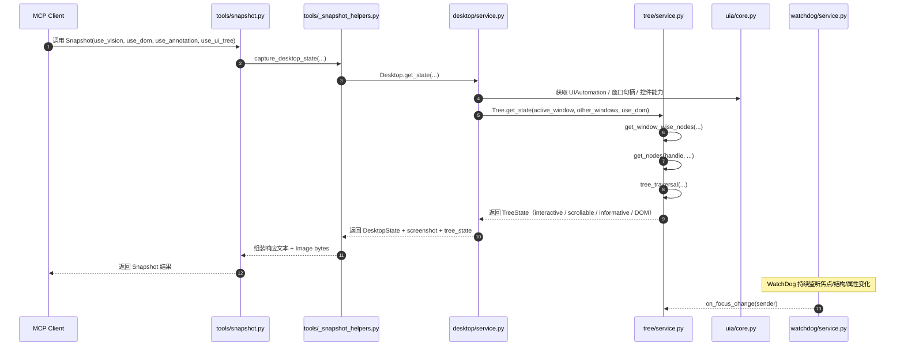

# Windows-MCP-main 源码分析文档

> 本文档整合了 `源码分析.md` 与 `源码分析_逐文件版.md` 的内容，并进一步补充了各 `.py` 文件的关键函数级说明，重点梳理项目的目录结构、实现方案、执行流程、功能模块、技术架构与使用方式。

---

## 1. 项目概述

`Windows-MCP` 是一个基于 **MCP（Model Context Protocol）** 的 Windows 桌面自动化服务器。它将 Windows 系统能力封装成 MCP tools，供 AI Agent / LLM 通过标准协议调用，从而完成：

- 文件导航与文件系统操作
- 应用启动、窗口切换与窗口调整
- 鼠标、键盘、滚动等交互操作
- 截图与桌面状态快照
- UIA 元素识别与 DOM 抽取
- 进程、剪贴板、注册表、通知等系统能力
- 网页内容抓取

项目的核心思路不是依赖传统视觉模型，而是直接基于 **Windows UI Automation（UIA）**、窗口句柄、桌面截图和浏览器 DOM 信息，向 Agent 提供结构化桌面状态。

---

## 2. 技术架构总览

项目整体可分为 5 层：

1. **协议层**
   - 使用 `FastMCP` 暴露 MCP tools。
   - 对外提供统一的标准工具接口。

2. **工具层**
   - 位于 `src/windows_mcp/tools/`。
   - 负责把 MCP 请求参数转换为内部服务调用。

3. **桌面服务层**
   - 位于 `src/windows_mcp/desktop/`。
   - 负责真正执行 Windows 系统操作：窗口、输入、截图、进程、通知、剪贴板、抓取等。

4. **UIA / 树识别层**
   - 位于 `src/windows_mcp/uia/` 与 `src/windows_mcp/tree/`。
   - 负责遍历 Windows UIAutomation 树，识别可交互元素、滚动区域、文本节点，以及浏览器 DOM 内容。

5. **运行支撑层**
   - 位于 `src/windows_mcp/auth/`、`analytics.py`、`watchdog/` 等模块。
   - 负责远程认证、遥测埋点、UIA 事件监听与状态同步。

---

## 3. 详细目录树

```text
Windows-MCP-main/
├── .gitignore
├── .mcpbignore
├── .python-version
├── CLAUDE.md
├── LICENSE.md
├── README.md
├── manifest.json
├── pyproject.toml
├── server.json
├── uv.lock
├── .github/
│   ├── FUNDING.yml
│   ├── dependabot.yml
│   └── workflows/
│       └── publish.yml
├── .claude/
│   └── skills/
│       └── windows-mcp-tool-tester/
│           └── SKILL.md
└── src/
    └── windows_mcp/
        ├── __main__.py
        ├── analytics.py
        ├── config.py
        ├── paths.py
        ├── auth/
        │   ├── __init__.py
        │   └── service.py
        ├── desktop/
        │   ├── __init__.py
        │   ├── config.py
        │   ├── powershell.py
        │   ├── screenshot.py
        │   ├── service.py
        │   ├── utils.py
        │   └── views.py
        ├── filesystem/
        │   ├── __init__.py
        │   ├── service.py
        │   └── views.py
        ├── tools/
        │   ├── __init__.py
        │   ├── _snapshot_helpers.py
        │   ├── app.py
        │   ├── clipboard.py
        │   ├── filesystem.py
        │   ├── input.py
        │   ├── multi.py
        │   ├── notification.py
        │   ├── process.py
        │   ├── registry.py
        │   ├── scrape.py
        │   ├── shell.py
        │   └── snapshot.py
        ├── tree/
        │   ├── cache_utils.py
        │   ├── config.py
        │   ├── service.py
        │   ├── utils.py
        │   └── views.py
        ├── uia/
        │   ├── __init__.py
        │   ├── controls.py
        │   ├── core.py
        │   ├── enums.py
        │   ├── events.py
        │   └── patterns.py
        ├── watchdog/
        │   ├── __init__.py
        │   ├── event_handlers.py
        │   └── service.py
        └── vdm/
            ├── __init__.py
            └── core.py
```

---

## 4. 各文件职责表

### 4.1 根目录文件

| 文件 | 职责 |
|---|---|
| `README.md` | 项目简介、安装、使用方式、功能说明 |
| `CLAUDE.md` | 开发辅助说明：架构、命令、环境变量、安全边界 |
| `pyproject.toml` | 项目元数据、依赖、脚本入口、格式化与测试配置 |
| `manifest.json` | MCP 包和工具清单配置 |
| `server.json` | 服务运行配置 |
| `uv.lock` | 依赖锁定文件 |
| `.python-version` | Python 版本约束 |
| `.gitignore` | Git 忽略规则 |
| `.mcpbignore` | MCP 包构建忽略规则 |
| `LICENSE.md` | MIT 许可证 |
| `.github/workflows/publish.yml` | 自动发布流程 |

### 4.2 入口与运行控制

| 文件 | 职责 |
|---|---|
| `src/windows_mcp/__main__.py` | 运行入口；创建 FastMCP、注册工具、初始化 Desktop/WatchDog/Analytics、启动本地或远程模式 |
| `src/windows_mcp/config.py` | 调试与运行配置 |
| `src/windows_mcp/paths.py` | 路径相关辅助函数 |
| `src/windows_mcp/analytics.py` | PostHog 遥测与工具执行埋点 |

### 4.3 认证层

| 文件 | 职责 |
|---|---|
| `src/windows_mcp/auth/service.py` | 远程模式认证客户端，获取 session token 并构造代理连接信息 |
| `src/windows_mcp/auth/__init__.py` | 认证模块导出 |

### 4.4 桌面核心层

| 文件 | 职责 |
|---|---|
| `src/windows_mcp/desktop/service.py` | 桌面自动化总控制器：窗口、输入、截图、状态、进程、通知、剪贴板、抓取等 |
| `src/windows_mcp/desktop/powershell.py` | PowerShell 命令执行封装 |
| `src/windows_mcp/desktop/screenshot.py` | 截图后端实现与图像采集 |
| `src/windows_mcp/desktop/utils.py` | 桌面相关工具函数 |
| `src/windows_mcp/desktop/views.py` | 桌面状态数据模型，如 `DesktopState`、`Window`、`Size`、`BoundingBox` |
| `src/windows_mcp/desktop/config.py` | 桌面层配置常量 |

### 4.5 UI Automation 底层封装

| 文件 | 职责 |
|---|---|
| `src/windows_mcp/uia/core.py` | UIAutomation COM 核心封装与单例入口 |
| `src/windows_mcp/uia/controls.py` | 各类 UIA 控件封装 |
| `src/windows_mcp/uia/patterns.py` | UIA patterns 封装 |
| `src/windows_mcp/uia/enums.py` | UIA 枚举定义 |
| `src/windows_mcp/uia/events.py` | UIA 事件订阅相关封装 |
| `src/windows_mcp/uia/__init__.py` | UIA 模块导出 |

### 4.6 UI 树识别层

| 文件 | 职责 |
|---|---|
| `src/windows_mcp/tree/service.py` | 遍历 UIA 树，识别交互元素、滚动元素、文本节点与 DOM 元素 |
| `src/windows_mcp/tree/views.py` | UI 树状态模型，如 `TreeElementNode`、`ScrollElementNode`、`TextElementNode`、`TreeState` |
| `src/windows_mcp/tree/config.py` | UI 元素识别规则与常量 |
| `src/windows_mcp/tree/utils.py` | 树遍历辅助函数 |
| `src/windows_mcp/tree/cache_utils.py` | UIA 缓存请求与缓存控件工具 |

### 4.7 监控与事件监听

| 文件 | 职责 |
|---|---|
| `src/windows_mcp/watchdog/service.py` | UIA 事件监听服务，监控焦点、结构与属性变化 |
| `src/windows_mcp/watchdog/event_handlers.py` | 各类 UIA 事件回调处理器 |
| `src/windows_mcp/watchdog/__init__.py` | 监控模块导出 |

### 4.8 文件系统层

| 文件 | 职责 |
|---|---|
| `src/windows_mcp/filesystem/service.py` | 文件读写、复制、移动、删除、搜索、信息读取 |
| `src/windows_mcp/filesystem/views.py` | 文件系统结果模型 |
| `src/windows_mcp/filesystem/__init__.py` | 文件系统模块导出 |

### 4.9 工具暴露层

| 文件 | 职责 |
|---|---|
| `src/windows_mcp/tools/__init__.py` | 汇总注册全部工具模块到 FastMCP |
| `src/windows_mcp/tools/app.py` | App 工具：启动、切换、调整窗口 |
| `src/windows_mcp/tools/shell.py` | PowerShell 工具 |
| `src/windows_mcp/tools/snapshot.py` | Snapshot / Screenshot 工具 |
| `src/windows_mcp/tools/_snapshot_helpers.py` | Snapshot / Screenshot 的共享实现 |
| `src/windows_mcp/tools/input.py` | Click / Type / Scroll / Move / Shortcut / Wait 工具 |
| `src/windows_mcp/tools/multi.py` | MultiSelect / MultiEdit 工具 |
| `src/windows_mcp/tools/clipboard.py` | 剪贴板工具 |
| `src/windows_mcp/tools/process.py` | 进程管理工具 |
| `src/windows_mcp/tools/notification.py` | 通知工具 |
| `src/windows_mcp/tools/filesystem.py` | 文件系统 MCP 工具 |
| `src/windows_mcp/tools/registry.py` | 注册表工具 |
| `src/windows_mcp/tools/scrape.py` | 网页抓取工具 |

### 4.10 虚拟桌面层

| 文件 | 职责 |
|---|---|
| `src/windows_mcp/vdm/core.py` | 虚拟桌面管理相关逻辑 |
| `src/windows_mcp/vdm/__init__.py` | 虚拟桌面模块导出 |

---

## 5. Mermaid 架构图

### 5.1 总体分层架构图



### 5.2 核心模块关系图



### 5.3 运行时启动流程图

```mermaid
flowchart TD
    A[启动 windows-mcp] --> B{读取 MODE}
    B -->|local| C[_build_local_mcp()]
    B -->|remote| D[_run_remote_mode()]

    C --> E[创建 FastMCP]
    E --> F[初始化 Desktop]
    E --> G[初始化 WatchDog]
    E --> H[初始化 Analytics]
    E --> I[register_all() 注册 tools]
    F --> G1[watchdog.set_focus_callback(desktop.tree.on_focus_change)]
    G --> J[watchdog.start()]
    H --> K[PostHogAnalytics]
    I --> L[开放 MCP tools]
    J --> M[进入主循环]

    D --> N[AuthClient.authenticate()]
    N --> O[获取 proxy_url / proxy_headers]
    O --> P[FastMCP.as_proxy(...) ]
    P --> Q[开放远程 proxy MCP tools]
```

### 5.4 Snapshot 执行流程图

```mermaid
flowchart TD
    A[调用 Snapshot / Screenshot] --> B[_snapshot_helpers.capture_desktop_state()]
    B --> C[Desktop.get_state()]
    C --> D[Tree.get_state()]
    D --> E[Tree.get_window_wise_nodes()]
    E --> F[Tree.get_nodes()]
    F --> G[Tree.tree_traversal()]
    G --> H[识别 interactive / scrollable / informative nodes]
    H --> I[构建 TreeState]
    I --> J[构建 DesktopState]
    J --> K[build_snapshot_response()]
    K --> L[返回文本 + 图片]
```

### 5.5 UIA 事件监听流程图

```mermaid
flowchart TD
    A[WatchDog.start()] --> B[创建 STA 线程]
    B --> C[WatchDog._run()]
    C --> D[AddFocusChangedEventHandler]
    C --> E[AddStructureChangedEventHandler]
    C --> F[AddPropertyChangedEventHandler]
    C --> G[PumpEvents(0.1)]
    D --> H[FocusChangedEventHandler]
    E --> I[StructureChangedEventHandler]
    F --> J[PropertyChangedEventHandler]
    H --> K[Tree.on_focus_change()]
    I --> L[状态更新/结构同步]
    J --> L
```

---

## 6. 核心调用链

### 5.1 启动流程

```text
MCP Client
  └── 调用 windows-mcp
        └── src/windows_mcp/__main__.py
              ├── 创建 FastMCP
              ├── 初始化 Desktop / WatchDog / Analytics
              ├── register_all() 注册 tools/*
              └── 按 MODE 启动 local 或 remote server
```

### 5.2 Snapshot 流程

```text
Client 调用 Snapshot
  └── tools/snapshot.py
        └── capture_desktop_state()
              └── Desktop.get_state()
                    └── Tree.get_state()
                          └── Tree.get_window_wise_nodes()
                                └── Tree.get_nodes()
                                      └── Tree.tree_traversal()
```

### 5.3 Click / Type 流程

```text
Client 调用 Click / Type
  └── tools/input.py
        ├── 如果传 label，先通过 Desktop.get_coordinates_from_label() 定位
        └── 再调用 Desktop.click() / Desktop.type()
```

### 5.4 WatchDog 事件流

```text
WatchDog._run()
  ├── 注册 UIA 事件监听器
  ├── PumpEvents() 驱动事件循环
  └── 焦点变化时回调 Tree.on_focus_change()
```

---

## 6. 关键实现方案

### 6.1 Snapshot / Screenshot

- `Snapshot` 是重型状态采集：截图 + UI 树 + 可交互元素 + 可滚动元素 + DOM 信息。
- `Screenshot` 是轻量状态采集：优先速度，跳过 UI 树提取。
- 两者共享 `_snapshot_helpers.py` 中的核心逻辑。

### 6.2 Tree 遍历

`tree/service.py` 负责从窗口句柄递归遍历 UIA 控件树，并按规则提取：

- 交互元素
- 滚动区域
- 文本元素
- 浏览器 DOM 元素

同时还会处理：

- modal dialog
- browser DOM 模式
- UIA 缓存
- comtypes 异常重试

### 6.3 WatchDog 监听

`watchdog/service.py` 在独立 STA 线程里维护事件订阅，监听：

- 焦点变化
- 结构变化
- 属性变化

这样能保持桌面状态的实时性。

### 6.4 远程模式代理

当 `MODE=remote` 时：

- 通过 `AuthClient` 完成认证
- 获取代理 URL 和 token
- 使用 `FastMCP.as_proxy(...)` 转成代理服务

---

## 7. 功能清单

该项目对外提供的主要能力包括：

- `App`：启动、切换、调整窗口
- `PowerShell`：执行系统命令
- `Snapshot`：获取桌面完整状态
- `Screenshot`：快速截图
- `Click`：鼠标点击
- `Type`：键盘输入
- `Scroll`：滚动
- `Move`：鼠标移动/拖拽
- `Shortcut`：快捷键
- `Wait`：等待
- `MultiSelect`：批量选择
- `MultiEdit`：批量输入
- `Clipboard`：剪贴板操作
- `Process`：进程管理
- `Notification`：系统通知
- `FileSystem`：文件系统操作
- `Registry`：注册表操作
- `Scrape`：网页抓取

---

## 8. 工具调用关系总表

下面把每个 MCP tool 对应的内部函数链路整理成一张总表，便于汇报时快速说明“对外工具名 → 内部入口 → 核心实现 → 最终动作”。

| MCP Tool | 参数/用途 | 内部调用链路 | 关键实现文件 | 最终执行动作 |
|---|---|---|---|---|
| `App` | 启动、切换、调整窗口 | `tools/app.py` → `Desktop.app()` / `Desktop.resize()` / `Desktop.switch()` | `tools/app.py`、`desktop/service.py` | 启动应用、切换窗口、调整窗口位置和大小 |
| `PowerShell` | 执行 PowerShell 命令 | `tools/shell.py` → `PowerShellExecutor.execute_command()` | `tools/shell.py`、`desktop/powershell.py` | 执行系统命令并返回输出 |
| `Snapshot` | 完整桌面状态采集 | `tools/snapshot.py` → `capture_desktop_state()` → `Desktop.get_state()` → `Tree.get_state()` → `Tree.get_nodes()` → `Tree.tree_traversal()` | `tools/snapshot.py`、`tools/_snapshot_helpers.py`、`desktop/service.py`、`tree/service.py` | 返回文本化桌面状态 + UI 元素列表 + 截图 |
| `Screenshot` | 快速截图 | `tools/snapshot.py` → `capture_desktop_state()` → `Desktop.get_state(use_ui_tree=False)` | `tools/snapshot.py`、`tools/_snapshot_helpers.py`、`desktop/service.py` | 返回轻量截图 + 基础桌面信息 |
| `Click` | 鼠标点击 | `tools/input.py` → `_resolve_label()`（可选）→ `Desktop.click()` | `tools/input.py`、`desktop/service.py` | 在指定坐标点击鼠标 |
| `Type` | 文本输入 | `tools/input.py` → `_resolve_label()`（可选）→ `Desktop.type()` | `tools/input.py`、`desktop/service.py` | 在目标位置输入文本 |
| `Scroll` | 鼠标滚动 | `tools/input.py` → `_resolve_label()`（可选）→ `Desktop.scroll()` | `tools/input.py`、`desktop/service.py` | 纵向/横向滚动页面或区域 |
| `Move` | 鼠标移动/拖拽 | `tools/input.py` → `_resolve_label()`（可选）→ `Desktop.move()` / `Desktop.drag()` | `tools/input.py`、`desktop/service.py` | 移动鼠标或执行拖拽 |
| `Shortcut` | 快捷键组合 | `tools/input.py` → `Desktop.shortcut()` | `tools/input.py`、`desktop/service.py` | 发送组合键，如 Ctrl+C、Alt+Tab |
| `Wait` | 等待指定时间 | `tools/input.py` → `time.sleep()` | `tools/input.py` | 阻塞等待指定秒数 |
| `MultiSelect` | 批量选择多个元素 | `tools/multi.py` → `desktop.get_coordinates_from_label()`（可选）→ `Desktop.multi_select()` | `tools/multi.py`、`desktop/service.py` | 批量点选、文件多选、控件多选 |
| `MultiEdit` | 批量输入多个字段 | `tools/multi.py` → `desktop.get_coordinates_from_label()`（可选）→ `Desktop.multi_edit()` | `tools/multi.py`、`desktop/service.py` | 同时向多个输入框写入文本 |
| `Clipboard` | 剪贴板读写 | `tools/clipboard.py` → `win32clipboard.OpenClipboard()` / `GetClipboardData()` / `SetClipboardText()` | `tools/clipboard.py` | 读取或设置 Windows 剪贴板 |
| `Process` | 进程列表/终止 | `tools/process.py` → `Desktop.list_processes()` / `Desktop.kill_process()` | `tools/process.py`、`desktop/service.py` | 列出或结束进程 |
| `Notification` | Windows 通知 | `tools/notification.py` → `Desktop.send_notification()` | `tools/notification.py`、`desktop/service.py` | 弹出 toast 通知 |
| `FileSystem` | 文件/目录操作 | `tools/filesystem.py` → `windows_mcp.filesystem.service.*` | `tools/filesystem.py`、`filesystem/service.py` | 文件读写、拷贝、移动、删除、搜索、信息查询 |
| `Registry` | 注册表操作 | `tools/registry.py` → `Desktop` 或系统注册表封装 | `tools/registry.py`、`desktop/service.py`（及相关系统封装） | 读取/写入/删除/枚举注册表 |
| `Scrape` | 网页抓取 | `tools/scrape.py` → `Desktop.scrape(url)` 或 `Desktop.get_state(use_dom=True)` → `tree_state.dom_informative_nodes` | `tools/scrape.py`、`desktop/service.py`、`tree/service.py` | 抓取网页内容，支持 DOM 模式 |

### 8.1 调用关系解读

- **所有 MCP Tool 的入口都在 `tools/` 目录**，它们只负责参数校验、转换与调用，不直接承担复杂业务。
- **真正执行 Windows 动作的是 `Desktop`**，例如点击、输入、滚动、窗口控制、通知、进程管理等。
- **桌面状态感知依赖 `Tree`**，尤其是 `Snapshot` / `Screenshot` / `Scrape(use_dom=True)` 这些场景。
- **`WatchDog` 负责事件同步**，帮助桌面状态保持最新，但它不是某个 MCP Tool 的直接实现路径，而是底层运行支撑。
- **`Analytics` 贯穿所有 tools**，负责记录调用耗时和成功/失败。

### 8.2 最常见的几条链路

```text
Snapshot
  └── tools/snapshot.py
        └── tools/_snapshot_helpers.py
              └── desktop/service.py::get_state()
                    └── tree/service.py::get_state()
                          └── tree/service.py::get_nodes()
                                └── tree/service.py::tree_traversal()
```

```text
Click / Type / Scroll / Move / Shortcut
  └── tools/input.py
        └── desktop/service.py 对应方法
```

```text
FileSystem
  └── tools/filesystem.py
        └── filesystem/service.py 对应文件操作函数
```

```text
Scrape
  ├── use_dom=False -> desktop/service.py::scrape()
  └── use_dom=True  -> desktop/service.py::get_state(use_dom=True)
                         └── tree/service.py::dom_informative_nodes
```

---

## 9. 端到端时序图

下面以 `Snapshot` 为例，给出一个从 MCP Client 发起请求到最终返回结果的完整时序图。该流程同样适用于 `Screenshot`、`Scrape(use_dom=True)` 等需要桌面状态感知的能力。



### 9.1 时序说明

1. **MCP Client 调用 `Snapshot`**
   - 这是 Agent 侧的入口。
   - 用于请求当前桌面状态。

2. **`tools/snapshot.py` 接收调用**
   - 负责参数入口与工具语义。
   - 再转发给共享逻辑层。

3. **`tools/_snapshot_helpers.py` 统一处理采集逻辑**
   - 负责截图、状态采集、文本整理、图片编码。

4. **`desktop/service.py` 生成 `DesktopState`**
   - 收集活动窗口、窗口列表、屏幕尺寸、截图、鼠标位置等。

5. **`tree/service.py` 生成 `TreeState`**
   - 遍历 UIA 树，识别可交互元素、滚动元素、文本节点和浏览器 DOM。

6. **`uia/core.py` 提供底层 UIAutomation 能力**
   - 供 Desktop / Tree / WatchDog 访问 Windows UIA。

7. **`watchdog/service.py` 持续监听变化**
   - 在后台维护焦点与结构变化，辅助状态保持最新。

8. **结果回传给 MCP Client**
   - 返回文本化桌面状态 + 可选图片，供 LLM/Agent 后续决策。

---

## 10. 使用方式

### 8.1 安装与运行

```bash
uv sync
uv run windows-mcp
```

### 8.2 常见环境变量

- `WINDOWS_MCP_SCREENSHOT_SCALE`
- `WINDOWS_MCP_SCREENSHOT_BACKEND`
- `WINDOWS_MCP_PROFILE_SNAPSHOT`
- `WINDOWS_MCP_DEBUG`
- `ANONYMIZED_TELEMETRY`
- `MODE`
- `SANDBOX_ID`
- `API_KEY`

### 8.3 典型使用流程

1. 先调用 `Snapshot` 查看当前桌面状态。
2. 根据返回的元素、窗口或坐标决定下一步操作。
3. 再调用 `Click`、`Type`、`Scroll`、`App` 等工具执行动作。
4. 必要时再次 `Snapshot` 验证结果。

这是一种典型的“先感知，再行动”的 Agent 工作流。

---

## 9. 项目特点

### 优点

- 基于 UI Automation，结构化程度高
- 支持桌面与浏览器 DOM 双场景
- 工具层与实现层分离清晰
- 支持本地与远程两种模式
- 有遥测、日志、性能 profiling 支持
- Snapshot / Screenshot 设计合理，兼顾速度与信息量

### 风险与限制

- 仅适用于 Windows
- 系统级权限较高，误操作风险大
- COM / UIA 依赖复杂，兼容性受环境影响
- 某些控件识别与浏览器 DOM 抽取受具体应用影响

---

## 10. 逐文件函数级说明

下面补充各 `.py` 文件的关键函数级说明。

### 10.1 `src/windows_mcp/__main__.py`

**关键函数/对象**：
- `_get_desktop()`：返回全局 `desktop` 单例。
- `_get_analytics()`：返回全局 `analytics` 单例。
- `_http_middleware()`：构造 HTTP 中间件列表，加入 `OptionsMiddleware` 和 CORS。
- `OptionsMiddleware.__call__()`：拦截 OPTIONS 请求并直接返回 200。
- `_add_cors_options_handlers()`：当前为兼容占位函数。
- `_build_local_mcp()`：创建本地 `FastMCP`，设置 lifespan，注册所有工具。
- `__getattr__()`：按需暴露 `state_tool` / `screenshot_tool`。
- `_get_remote_proxy_types()`：动态导入远程代理类型。
- `_run_local_mode()`：根据 transport 启动本地 MCP server。
- `_run_remote_mode()`：认证远程模式并启动 proxy MCP server。
- `main()`：CLI 入口，读取环境变量并决定 local/remote。

**调用重点**：
- `main()` 是总入口
- `_build_local_mcp()` 是本地模式装配核心
- `lifespan()` 负责启动/停止时的资源管理

---

### 10.2 `src/windows_mcp/analytics.py`

**关键类/函数**：
- `PostHogAnalytics.__init__()`：初始化 PostHog 客户端、会话 ID、模式信息。
- `PostHogAnalytics.user_id`：从临时文件读取或生成用户 ID。
- `track_tool()`：上报工具执行成功事件。
- `track_error()`：上报工具异常事件。
- `is_feature_enabled()`：查询功能开关。
- `close()`：关闭 PostHog 客户端。
- `with_analytics()`：为 tool 函数包装耗时统计、成功/失败上报。

**调用重点**：
- `tools/*` 中几乎所有 tool 都通过 `@with_analytics(...)` 包装
- 异步和同步函数都兼容

---

### 10.3 `src/windows_mcp/auth/service.py`

**关键类/函数**：
- `AuthClient.authenticate()`：执行认证流程。
- `AuthClient._request()` / `_retry_*`（若存在）：封装 HTTP 请求与重试。
- `proxy_url` / `proxy_headers`：供远程代理构造连接使用。

**调用重点**：
- `__main__.py::_run_remote_mode()` 调用认证

---

### 10.4 `src/windows_mcp/desktop/powershell.py`

**关键函数**：
- `PowerShellExecutor.execute_command(command, timeout)`：执行 PowerShell 命令并返回输出与状态码。

**调用重点**：
- `tools/shell.py` 的 `PowerShell` tool 直接调用它

---

### 10.5 `src/windows_mcp/desktop/screenshot.py`

**关键函数/逻辑**：
- 截图后端初始化与选择
- 屏幕捕获主函数
- 缩放和裁剪逻辑
- 失败时的回退策略

**调用重点**：
- 被 `Desktop.get_state()` / Snapshot 相关流程使用

---

### 10.6 `src/windows_mcp/desktop/service.py`

**关键函数（按能力）**：
- `get_state(...)`：构造 `DesktopState`，联动 Tree 和截图。
- `click(...)`：执行鼠标点击。
- `type(...)`：执行文本输入。
- `scroll(...)`：执行滚动。
- `move(...)`：移动鼠标。
- `drag(...)`：拖拽鼠标。
- `shortcut(...)`：执行键盘快捷键。
- `scrape(...)`：网页抓取。
- `list_processes(...)`：列出进程。
- `kill_process(...)`：终止进程。
- `send_notification(...)`：发送通知。
- `get_coordinates_from_label(...)`：根据 label 查找坐标。
- 其它窗口管理方法：launch / resize / switch 等。

**调用重点**：
- 是所有桌面动作的最终执行者
- tool 层只是参数包装，真正动作都落到 Desktop

---

### 10.7 `src/windows_mcp/desktop/utils.py`

**关键函数**：
- 字符过滤/清洗
- 坐标辅助
- 其它桌面通用小工具

---

### 10.8 `src/windows_mcp/desktop/views.py`

**关键数据模型**：
- `DesktopState`：桌面状态总容器
- `Window`：窗口信息
- `Size`：宽高
- `BoundingBox`：区域边界
- `Status`：状态描述

---

### 10.9 `src/windows_mcp/filesystem/service.py`

**关键函数**：
- `read_file(path, offset, limit, encoding)`
- `write_file(path, content, append, encoding)`
- `copy_path(path, destination, overwrite)`
- `move_path(path, destination, overwrite)`
- `delete_path(path, recursive)`
- `list_directory(path, pattern, recursive, show_hidden)`
- `search_files(path, pattern, recursive)`
- `get_file_info(path)`

**调用重点**：
- `tools/filesystem.py` 作为 MCP 接口层调用这里的函数

---

### 10.10 `src/windows_mcp/tools/__init__.py`

**关键函数/对象**：
- `_MODULES`：工具模块列表
- `register_all(mcp, get_desktop, get_analytics)`：逐个调用模块的 `register()`

**调用重点**：
- 这是 tool 注册总入口

---

### 10.11 `src/windows_mcp/tools/app.py`

**关键工具**：
- `App` tool

**关键行为**：
- `launch`：启动应用
- `resize`：调整窗口
- `switch`：切换窗口焦点

---

### 10.12 `src/windows_mcp/tools/shell.py`

**关键工具**：
- `PowerShell` tool

**关键函数**：
- `powershell_tool(command, timeout, ctx)`：执行命令并返回文本结果

---

### 10.13 `src/windows_mcp/tools/snapshot.py`

**关键工具**：
- `Snapshot` tool
- `Screenshot` tool

**关键函数**：
- `state_tool(...)`：完整桌面状态采集
- `screenshot_tool(...)`：轻量截图采集

**调用重点**：
- 两者都依赖 `_snapshot_helpers.capture_desktop_state()`

---

### 10.14 `src/windows_mcp/tools/_snapshot_helpers.py`

**关键函数**：
- `_screenshot_scale()`：读取并校正截图缩放比例
- `_snapshot_profile_enabled()`：判断是否启用 profiling
- `_as_bool(value)`：兼容字符串/布尔参数
- `capture_desktop_state(...)`：采集桌面状态并返回结构化结果
- `build_snapshot_response(...)`：把采集结果整理成 MCP response

**调用重点**：
- Snapshot 与 Screenshot 的核心共享逻辑

---

### 10.15 `src/windows_mcp/tools/input.py`

**关键函数**：
- `_resolve_label(desktop, label)`：通过 label 查找坐标
- `click_tool(...)`：点击
- `type_tool(...)`：输入文本
- `scroll_tool(...)`：滚动
- `move_tool(...)`：移动或拖拽
- `shortcut_tool(...)`：快捷键
- `wait_tool(duration, ctx)`：等待

**调用重点**：
- 所有输入动作都依赖 `Desktop` 的底层实现

---

### 10.16 `src/windows_mcp/tools/multi.py`

**关键函数**：
- `multi_select_tool(...)`：批量选择多个元素
- `multi_edit_tool(...)`：批量向多个输入框写入文本

**调用重点**：
- 依赖 `desktop.get_coordinates_from_label()` 和 `Desktop.multi_*`

---

### 10.17 `src/windows_mcp/tools/clipboard.py`

**关键函数**：
- `clipboard_tool(mode, text, ctx)`：读取或设置剪贴板文本

**调用重点**：
- 直接使用 `win32clipboard`

---

### 10.18 `src/windows_mcp/tools/process.py`

**关键函数**：
- `process_tool(mode, name, pid, sort_by, limit, force, ctx)`：列进程或杀进程

**调用重点**：
- 调 `Desktop.list_processes()` / `Desktop.kill_process()`

---

### 10.19 `src/windows_mcp/tools/notification.py`

**关键函数**：
- `notification_tool(title, message, app_id, ctx)`：发送 Windows toast 通知

**调用重点**：
- 调 `Desktop.send_notification()`

---

### 10.20 `src/windows_mcp/tools/filesystem.py`

**关键函数**：
- `file_system_tool(mode, path, destination, content, pattern, recursive, append, overwrite, offset, limit, encoding, show_hidden, ctx)`

**调用重点**：
- 统一分发到 `windows_mcp.filesystem.service` 中的具体实现
- 会先将相对路径解析到桌面目录

---

### 10.21 `src/windows_mcp/tools/scrape.py`

**关键函数**：
- `scrape_tool(url, query, use_dom, use_sampling, ctx)`

**调用重点**：
- `use_dom=False` 时调用 `Desktop.scrape(url)`
- `use_dom=True` 时调用 `Desktop.get_state(use_dom=True)` 并使用 DOM 信息
- `use_sampling=True` 时尝试通过 `ctx.sample()` 做内容清洗/摘要

---

### 10.22 `src/windows_mcp/tree/service.py`

**关键函数**：
- `Tree.get_state(active_window_handle, other_windows_handles, use_dom=False)`：生成 TreeState
- `Tree.get_window_wise_nodes(windows_handles, active_window_flag, use_dom=False)`：逐窗口处理并带重试
- `Tree.get_nodes(handle, is_browser=False, wait_time=0, use_dom=False)`：处理单窗口树提取
- `Tree.tree_traversal(...)`：递归遍历 UIA 控件树
- `Tree.iou_bounding_box(window_box, element_box)`：裁剪元素边界
- `Tree.element_has_child_element(node, control_type, child_control_type)`：判断特定父子关系
- `Tree._dom_correction(...)`：浏览器 DOM 纠正逻辑
- `Tree.app_name_correction(window_name)`：修正窗口名称
- `Tree.on_focus_change(sender)`：处理焦点变化事件

**调用重点**：
- 这是 UI 识别最核心的文件之一
- TreeState 的生成依赖它

---

### 10.23 `src/windows_mcp/tree/views.py`

**关键数据模型**：
- `TreeElementNode`
- `ScrollElementNode`
- `TextElementNode`
- `Center`
- `BoundingBox`
- `TreeState`

**作用**：
- 统一承载树遍历输出结果

---

### 10.24 `src/windows_mcp/tree/cache_utils.py`

**关键函数/类**：
- `CacheRequestFactory.create_tree_traversal_cache()`（或同类工厂方法）
- `CachedControlHelper.build_cached_control(...)`
- `CachedControlHelper.get_cached_children(...)`

**作用**：
- 降低 UIA 遍历开销

---

### 10.25 `src/windows_mcp/tree/utils.py`

**关键函数**：
- `random_point_within_bounding_box(...)`
- 其它坐标/选择辅助逻辑

---

### 10.26 `src/windows_mcp/watchdog/service.py`

**关键函数**：
- `WatchDog.__init__()`：初始化状态
- `WatchDog.__enter__()` / `__exit__()`：支持上下文管理器
- `WatchDog.start()`：启动监控线程
- `WatchDog.stop()`：停止监控线程
- `WatchDog.set_focus_callback(callback)`：设置焦点变化回调
- `WatchDog.set_structure_callback(callback, element=None)`：设置结构变化监听
- `WatchDog.set_property_callback(callback, element=None, property_ids=None)`：设置属性变化监听
- `WatchDog._run()`：事件循环与 handler 动态注册/注销

**调用重点**：
- `__main__.py` 的 lifespan 会启动它
- 它把焦点变化回调给 `Tree.on_focus_change()`

---

### 10.27 `src/windows_mcp/watchdog/event_handlers.py`

**关键类**：
- `FocusChangedEventHandler`
- `StructureChangedEventHandler`
- `PropertyChangedEventHandler`

**作用**：
- 将 UIA 事件转发到 `WatchDog`

---

### 10.28 `src/windows_mcp/uia/core.py`

**关键类/函数**：
- `_AutomationClient.instance()`：获取 UIAutomation 单例
- 初始化 COM / `IUIAutomation` 对象

**作用**：
- UIA 底层入口

---

### 10.29 `src/windows_mcp/uia/controls.py`

**关键类**：
- `Control`
- `WindowControl`
- `ButtonControl`
- `EditControl`
- `CheckBoxControl`
- `ComboBoxControl`
- `SliderControl`

**常见能力**：
- 读取 cached/live 属性
- 调用控件模式
- 获取子控件

---

### 10.30 `src/windows_mcp/uia/patterns.py`

**关键封装**：
- `ScrollPattern`
- `InvokePattern`
- `TogglePattern`
- `SelectionPattern`
- `RangeValuePattern`
- `ExpandCollapsePattern`

---

### 10.31 `src/windows_mcp/uia/enums.py`

**关键枚举**：
- `TreeScope`
- `ToggleState`
- `ExpandCollapseState`
- `PatternId`
- `PropertyId`

---

### 10.32 `src/windows_mcp/uia/events.py`

**关键内容**：
- UIA 事件订阅与通知相关辅助

---

### 10.33 `src/windows_mcp/filesystem/views.py`

**关键数据模型**：
- 文件系统操作返回结构

---

### 10.34 `src/windows_mcp/vdm/core.py`

**关键函数/逻辑**：
- 虚拟桌面识别
- 窗口与虚拟桌面归属判断

---

## 11. 总结

`Windows-MCP-main` 是一个结构清晰、分层明确的 Windows 自动化 MCP 服务端。它的核心不是单个工具，而是一整套围绕 Windows 桌面状态采集、UI 自动化识别、事件监听、系统执行和 MCP 工具暴露构建的完整架构。

如果把它抽象成一句话：

> 它通过 UI Automation + 桌面状态采集 + MCP 工具暴露，把 Windows 系统能力转成 LLM/Agent 可直接调用的标准接口。

---

## 12. 建议阅读顺序

如果你要继续深入源码，建议优先阅读：

1. `src/windows_mcp/__main__.py`
2. `src/windows_mcp/desktop/service.py`
3. `src/windows_mcp/tree/service.py`
4. `src/windows_mcp/watchdog/service.py`
5. `src/windows_mcp/tools/snapshot.py`
6. `src/windows_mcp/tools/input.py`
7. `src/windows_mcp/auth/service.py`
8. `src/windows_mcp/analytics.py`

这些文件构成了整个项目的主干逻辑。
